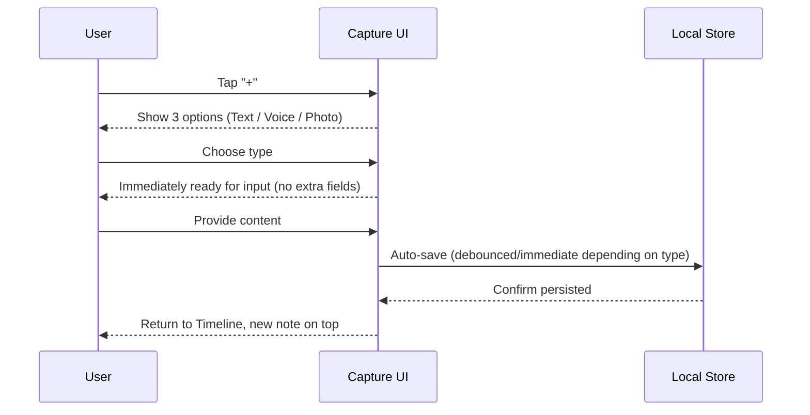
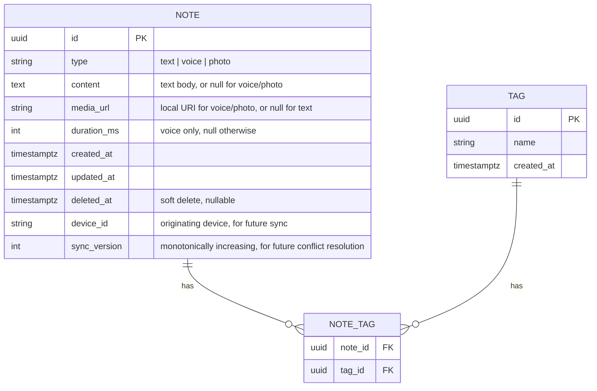

# Nex — Product Specification

> Companion document to [`Nex Product Vision`](./01-nex-product-vision.md). This document defines *what* is being built. The vision document defines *why*.

---

## Product Overview

Nex is a cross-platform capture application built around a single timeline of notes. A note may be text, a voice recording, or a photo. Every note is created through one universal "+" action, saved automatically, and immediately returned to the timeline. Organization (tags) is optional and always applied after capture. Search operates on text content, tags, dates, and content type.

---

## Goals

- Reduce capture time for any note type to under 3 seconds.
- Reduce search time for any previously captured note to under 3 seconds.
- Provide a single, chronological home (the Timeline) with no default folders.
- Support three capture types in v1: text, voice, photo.
- Provide lightweight, fully optional organization via tags.
- Lay a local-first data architecture that supports future sync without a rewrite.

## Non-Goals

- Rich text editing, nested documents, or databases (Notion-style).
- Task/project management (deadlines, boards, assignees).
- Multi-user collaboration or shared workspaces.
- A generic file attachment type (deferred to v2 — see [Future Features](#future-features)).
- Full cross-device sync (architected for in v1, delivered in v2).
- Speech-to-text and OCR (delivered in v3, see [Roadmap](#roadmap)).

---

## MVP Scope

The MVP intentionally narrows the original concept to only what directly serves the two core jobs — **capture fast** and **find fast**.

| In Scope (v1) | Out of Scope (v1) |
|---|---|
| Timeline home screen | Default/system folders |
| Text capture | Rich text formatting |
| Voice capture | Speech-to-text transcription |
| Photo capture (camera + gallery) | Generic file attachments |
| Auto-save, no Save button | Manual save / drafts |
| Tags (optional, freeform) | Nested tags / tag hierarchies |
| Search by text, tag, date | Semantic / AI-powered search |
| Content-type filter (text/voice/photo) as a search filter | Content-type as a separate search mode |
| Local-first storage with sync-ready IDs/timestamps | Real multi-device sync |

---

## User Stories

Written from the perspective of the primary persona (see Vision doc).

1. **As a user**, I want to tap one button and start typing immediately, so I can capture a thought before I forget it.
2. **As a user**, I want to tap one button and start recording audio immediately, so I can capture a thought while my hands are busy.
3. **As a user**, I want to snap or select a photo in two taps, so I can capture something visual without leaving the flow.
4. **As a user**, I never want to see a "Save" button, so I never worry about losing my capture.
5. **As a user**, I want my newest notes at the top of a single timeline, so I don't have to decide where something belongs before I see it again.
6. **As a user**, I want to add a tag to a note after I've captured it, so organizing never blocks capturing.
7. **As a user**, I want to search by keyword and instantly see matching text notes, so I can find an idea without remembering exactly where I put it.
8. **As a user**, I want to filter my search by tag, date, or content type, so I can narrow results when a keyword isn't enough.
9. **As a user**, I want to understand that voice notes are found by tag/date rather than keyword, so I don't waste time expecting a search feature that doesn't exist yet.
10. **As a user**, I want the app to work fully offline, so a bad connection never costs me a captured idea.

---

## Functional Requirements

### FR-1 — Capture
- FR-1.1 A persistent, prominent "+" action must be reachable from the Timeline in a single tap/click.
- FR-1.2 Tapping "+" presents exactly three capture options: Text, Voice, Photo.
- FR-1.3 Selecting **Text** opens an empty text field with the keyboard/cursor focused immediately.
- FR-1.4 Selecting **Voice** immediately starts recording (no intermediate "press to start" step).
- FR-1.5 Selecting **Photo** immediately opens the camera, with an explicit option to switch to gallery selection.
- FR-1.6 No field is mandatory. Title, tags, and folders are never requested during capture.
- FR-1.7 A note is saved automatically as soon as it contains content (first character typed, recording stopped, photo confirmed) — there is no explicit save action.
- FR-1.8 After saving, the user is returned directly to the Timeline with the new note visible at the top.
- FR-1.9 Canceling an empty capture (e.g., closing text entry with no text typed) discards it silently, without a confirmation dialog.

### FR-2 — Timeline
- FR-2.1 The Timeline is the default/home screen on app launch.
- FR-2.2 Notes are ordered reverse-chronologically (newest first).
- FR-2.3 Each note is rendered as a minimal card showing: a content preview (text snippet, waveform icon + duration, or photo thumbnail), timestamp, and tags (if any).
- FR-2.4 The Timeline contains no default folders, sections, or pre-existing categories.
- FR-2.5 The Timeline must support smooth infinite scroll/pagination for large note counts.

### FR-3 — Tags
- FR-3.1 Tags are entirely optional on every note type.
- FR-3.2 Tags can be added or removed at any time after capture, from the note's detail view or inline on the Timeline card.
- FR-3.3 Tags are freeform strings created by the user (no pre-defined taxonomy is required, though common suggestions such as *Idea, Work, Shopping, Learning, Inspiration* are offered).
- FR-3.4 A note may have zero, one, or multiple tags.

### FR-4 — Search
- FR-4.1 A persistent search entry point is accessible from the Timeline in one tap.
- FR-4.2 Full-text search runs against the content of text notes.
- FR-4.3 Search supports filtering by one or more tags.
- FR-4.4 Search supports filtering by date or date range.
- FR-4.5 Search supports filtering by content type (text / voice / photo) as an additional filter layered on top of tag/date search — not a separate search mode.
- FR-4.6 Because voice notes are not transcribed in v1, they are excluded from full-text keyword matching and are discoverable only via tag/date/type filters. The UI must clearly label voice notes with an indicator such as "Searchable by tag/date only" so expectations are set correctly.
- FR-4.7 Search results update as the user types (incremental search), respecting the 3-second find target.

### FR-5 — Data Integrity & Offline
- FR-5.1 The app must be fully functional offline for capture, timeline browsing, tagging, and search.
- FR-5.2 Every note is assigned a globally unique identifier (UUID) and `createdAt`/`updatedAt` timestamps at creation time, regardless of sync status.
- FR-5.3 No user action should ever be able to produce data loss under normal operation (app kill, device restart, low storage warnings excluded).

---

## Non-Functional Requirements

| Category | Requirement |
|---|---|
| **Performance** | Cold start to a capture-ready Timeline in < 1.5s on mid-tier hardware. Capture flow start-to-content-ready in < 1s. |
| **Reliability** | Auto-save must persist to durable local storage within 300ms of content change. |
| **Offline** | 100% of core flows (capture, timeline, tag, search) function with no network connection. |
| **Portability** | Data model must be platform-agnostic (Android, Windows, and future iOS clients share the same schema). |
| **Accessibility** | All interactive elements meet WCAG 2.1 AA contrast and tap-target size guidelines. |
| **Privacy** | No note content is transmitted anywhere unless the user explicitly enables a cloud/AI feature. |
| **Localization** | UI text is externalized from day one to support future language packs (initial ship: English; Persian is a first-class future target given the product's origin). |
| **Footprint** | Application install size and idle memory footprint stay minimal — no bundled frameworks that aren't essential to capture, timeline, or search. |

---

## Feature Specifications

### Navigation

Nex uses a deliberately shallow navigation structure — two primary destinations and one modal action:

```mermaid
flowchart LR
    A[Timeline - Home] -->|tap "+"| B[Capture Sheet]
    B -->|Text| B1[Text Capture]
    B -->|Voice| B2[Voice Capture]
    B -->|Photo| B3[Photo Capture]
    B1 -->|auto-save| A
    B2 -->|auto-save| A
    B3 -->|auto-save| A
    A -->|tap Search| C[Search]
    A -->|tap a card| D[Note Detail]
    D -->|edit tags| D
    D -->|back| A
    C -->|tap a result| D
```

There is no hamburger menu, no settings-heavy home screen, and no nested navigation deeper than two levels from the Timeline.

### User Flows

**Flow 1 — Capture a text idea**
1. User opens Nex → lands on Timeline.
2. User taps "+".
3. User taps "Text".
4. Keyboard opens with an empty, focused field.
5. User types their thought.
6. User taps back/close (or the system back gesture).
7. Note is already saved; Timeline shows it at the top.

**Flow 2 — Capture a voice memo**
1. User taps "+" → "Voice".
2. Recording starts immediately, with a visible timer and waveform.
3. User taps stop.
4. Note is saved as a voice note; Timeline shows it at the top with a play control and duration.

**Flow 3 — Find a note**
1. User taps the Search entry point from the Timeline.
2. User types a keyword, or applies a tag/date/type filter, or combines both.
3. Matching results render incrementally as the user types/filters.
4. User taps a result to open Note Detail, or acts directly on the result card.

**Flow 4 — Tag a note after the fact**
1. From the Timeline or Note Detail, user taps "Add tag" on a note.
2. A tag input appears with autocomplete of previously used tags.
3. User selects/creates a tag; it is attached instantly, no confirmation step.

### Search

Search is a first-class, equally-weighted pillar alongside capture. It is composed of:

- **Keyword search** — matches against the body of text notes only (v1). See [Section 5 of Nex.md](#speech-to-text-note) for the rationale on excluding voice notes.
- **Tag filter** — narrows results to notes carrying one or more selected tags.
- **Date filter** — narrows results to a specific day or range.
- **Content-type filter** — a checkbox-style refinement (Text / Voice / Photo) layered onto the same search surface, not a separate mode, keeping the v1 UI to a single search screen.

All filters are combinable (e.g., "voice notes tagged 'idea' from last week").

<a id="speech-to-text-note"></a>
> **Design note — Voice search limitation:** Since speech-to-text is deferred to v3, voice notes carry no transcribed body text in v1/v2. The UI marks each voice note with a small label — e.g., *"Searchable by tag/date only"* — so users never form an incorrect expectation that saying something aloud makes it keyword-searchable before v3 ships.

### Tags

- Tags are the **only** organizational primitive in the MVP. There are no folders, notebooks, or projects.
- Tags are optional at all times — a user can use Nex forever without ever creating one.
- Suggested starter tags are provided for discoverability: `Idea`, `Work`, `Shopping`, `Learning`, `Inspiration` — but the user is never forced to pick from this list.
- Tags are many-to-many with notes: one note can have multiple tags, one tag can apply to many notes.

### Timeline

- Reverse-chronological, single stream — the canonical "Inbox" of the product.
- No pinning, no manual reordering, no default categorization in v1 (kept intentionally simple; revisited only if user research demands it post-MVP).
- Each card adapts its preview to content type:
  - **Text:** first 2–3 lines of content.
  - **Voice:** waveform glyph + duration + play button.
  - **Photo:** thumbnail.
- Tags, if present, render as small chips on the card; absence of tags renders nothing extra (no empty-state clutter).

### Quick Capture

The single most important interaction in the product:



Key constraint: no screen in this sequence ever asks the user to name, file, or classify the note.

---

## Data Model

The schema is intentionally small and designed to be **sync-ready from day one** (see [Sync Strategy](#sync-strategy) and [`ARCHITECTURE.md`](./04-architecture.md)).



Notes:
- Every record carries a UUID (not an auto-increment integer) so IDs remain globally unique across offline devices, which is required for future multi-device sync.
- `deleted_at` implements soft deletes so that a future sync engine can propagate deletions instead of losing them to a hard delete.
- `sync_version` and `device_id` are present from v1 even though sync is not active, precisely so v2 sync does not require a schema migration or a data rewrite.
- Full-text search indexing is applied to `content` for text notes only, matching the v1 search scope.

---

## Sync Strategy

Sync is **not** a v1 user-facing feature, but the data layer is built as if it were arriving next release.

- **v1:** Local-first storage only. Every record already has a UUID, timestamps, `device_id`, and `sync_version`. A minimal backend API surface exists (even if unused by the client) so the contract is proven early.
- **v2:** Real sync between Android and Windows (first item of v2, not the last). Conflict resolution uses last-writer-wins at the field level keyed by `updated_at`/`sync_version`, with soft-deletes replicated across devices.
- **v2.x:** iOS client joins the same sync backend.

See [`ARCHITECTURE.md`](./04-architecture.md) for the technical design and [`ROADMAP.md`](./08-roadmap.md) for sequencing.

---

## AI Roadmap

AI capabilities are additive and strictly post-capture. None of them are part of the v1 MVP capture flow. Full detail in [`AI.md`](./09-ai.md).

| Capability | Target Version |
|---|---|
| Speech-to-text transcription | v3 |
| OCR on photos | v3 |
| Tag suggestions | v3 |
| Semantic search | v3 |
| Summarization | v3 |
| Related notes | v3 |

---

## Roadmap

High-level sequencing (full detail in [`ROADMAP.md`](./08-roadmap.md)):

- **v1 — Fastest capture experience:** Timeline, text/voice/photo capture, tags, keyword/tag/date/type search.
- **v2 — Sync & continuity:** Real Android ⇄ Windows sync (first, not last), generic file attachments, iOS client.
- **v3 — Intelligence layer:** Speech-to-text, OCR, tag suggestions, semantic search, summarization, related notes.

## Future Features

Explicitly deferred, tracked for evaluation post-MVP:

- Generic file attachments (v2) — requires UX decisions around preview, file size limits, and file-type handling that would otherwise force decisions at capture time.
- Full cross-device sync (v2).
- Speech-to-text (v3).
- OCR (v3).
- AI tag suggestions (v3).
- Semantic search (v3).
- Summarization (v3).
- Related Notes (v3).
- Export (evaluated post-v3; not on the current roadmap).

## Release Plan

| Release | Scope | Exit Criteria |
|---|---|---|
| v1.0 | Timeline, 3 capture types, tags, search (text/tag/date/type filter) | All FRs in this document pass QA; capture and search both consistently measure under 3 seconds in usability testing |
| v1.x | Stability, performance, accessibility polish | Crash-free session rate > 99.9%; WCAG 2.1 AA audit passed |
| v2.0 | Cross-device sync (Android ⇄ Windows) | Sync conflict tests pass; offline-edit-then-sync scenarios verified |
| v2.x | Generic file attachments, iOS client | Feature parity with Android/Windows confirmed |
| v3.0 | Speech-to-text, OCR, tag suggestions, semantic search, summarization, related notes | Voice/photo notes become part of full-text/semantic search without regressing capture speed |
