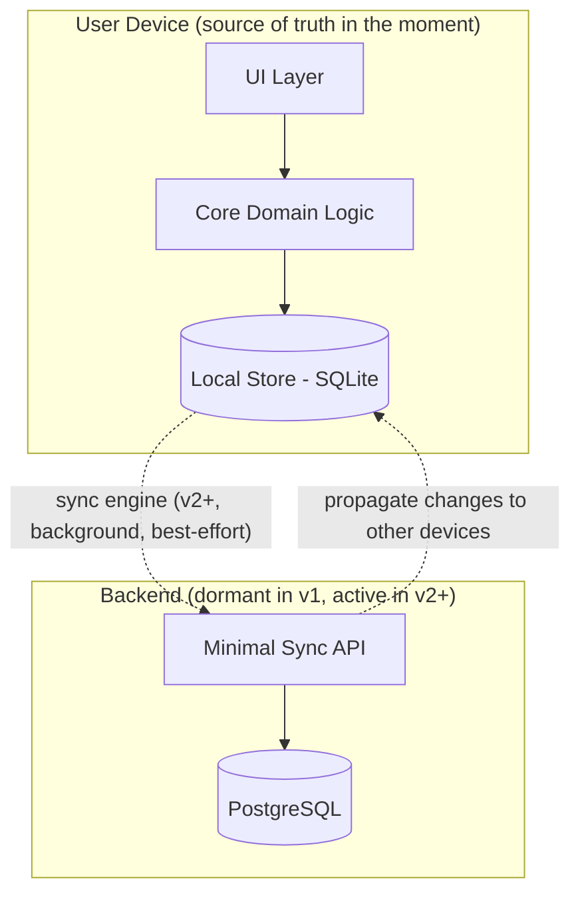
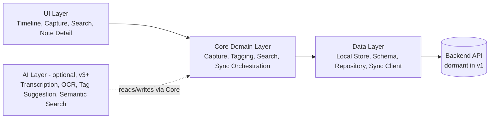
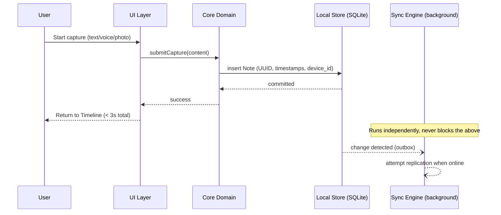
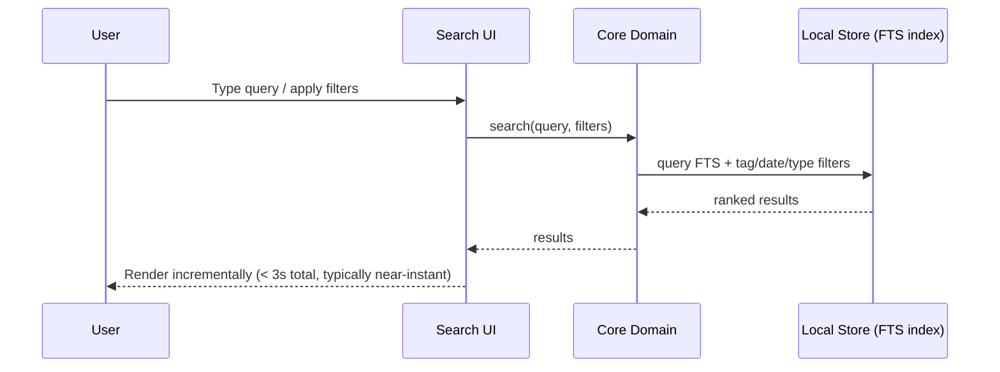
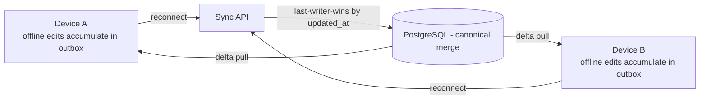

# Nex — Architecture

> Technical companion to [`Nex Product Specification`](./02-nex-product-specification.md). This document describes *how* Nex is built to satisfy the local-first, offline-first, and sync-ready requirements defined there.

---

## Guiding Constraints

The architecture exists to serve four constraints, in priority order:

1. **Capture must never wait on the network.**
2. **Capture must never wait on AI.**
3. **Data must be structured for future sync from day one**, without a v2 rewrite.
4. **The system must remain small and legible** — no infrastructure beyond what the product currently needs.

---

## Local-First Architecture

Nex follows a **local-first** model: the local device is the primary source of truth for the user's data at any given moment, and the network (when present) is a secondary replication channel — not a dependency.

Practical implications:

- Every write (capture, tag, edit) commits to the local store first and is immediately visible in the UI. Nothing waits on a network round trip.
- The backend, when active (v2+), is a **replication target**, not a gatekeeper. If it is unreachable, the app behaves identically from the user's perspective, aside from data not yet being mirrored to other devices.
- Conflict resolution is handled by the sync engine, never by the UI or the user, during normal use.

---

## Modular Architecture

The system is organized into independently testable modules with a strict dependency direction: UI depends on Core, Core depends on Data — never the reverse.

### Layers

| Layer | Responsibility | Notes |
|---|---|---|
| **UI Layer** | Renders Timeline, Capture flow, Search, Note Detail. Contains no persistence or business logic. | Shared across platforms via a common component/UI package (see [`README.md`](./03-readme.md#tech-stack)). |
| **Core Domain Layer** | Capture orchestration, tag management, search query composition, sync orchestration (what to sync, when, conflict policy). | Platform-agnostic; pure business logic, fully unit-testable without a UI or a database. |
| **Data Layer** | Local persistent storage (SQLite), repository interfaces, the sync client that talks to the backend when available. | Owns the schema described in the [Data Model](./02-nex-product-specification.md#data-model). |
| **Backend (minimal)** | A small REST/JSON API plus PostgreSQL, providing durable multi-device storage and conflict-aware replication. | Present from v1 as infrastructure, but not exercised by the client until v2 sync ships. |
| **AI Layer (optional)** | Transcription, OCR, tag suggestion, semantic search, summarization. | Strictly additive; communicates with Core through well-defined, asynchronous, non-blocking interfaces. Fully removable without breaking any other layer. |

This separation guarantees that **AI can be deleted from the build entirely and the product still fully satisfies its MVP promise** — a direct architectural expression of "AI-optional."

---

## Data Flow

### Capture (the critical path)

The capture path never touches the network. The sync engine observes local changes via an outbox/changefeed pattern and replicates opportunistically in the background.

### Search

Search executes entirely against the local store. Text notes are indexed for full-text search at write time (e.g., SQLite FTS5) so query latency stays flat regardless of corpus size growth within normal personal-use volumes.

---

## Storage

- **On-device:** SQLite is the canonical local store. It is transactional, requires no separate server process, supports full-text search natively (FTS5), and is available across Android, Windows, and iOS runtimes — a prerequisite for a genuinely shared data layer.
- **Media (voice, photo):** Binary content (audio files, images) is stored on the device filesystem; the database stores only a reference URI plus metadata (duration, mime type, size). This keeps the SQLite database itself small and fast regardless of media volume.
- **Backend:** PostgreSQL, matching the local schema closely (see [Data Model](./02-nex-product-specification.md#data-model)) so replication logic maps one-to-one between local and remote representations. Media in the cloud (v2+) is stored in object storage, referenced by URL, never inlined in the database.

---

## Sync

Sync is designed in v1 but not switched on for end users until v2. The design goals:

- **Additive, not corrective.** Sync should never need to "fix" a v1 schema; the schema is already sync-shaped (UUIDs, `device_id`, `updated_at`, `sync_version`, soft deletes).
- **Offline-tolerant.** Devices accumulate an outbox of unsynced changes and flush them opportunistically; a device that is offline for weeks must reconcile cleanly when it reconnects.
- **Conflict resolution:** last-writer-wins at the record level, decided by comparing `updated_at`/`sync_version`. Because Nex's data model favors small, mostly-append-only records (a captured note is rarely collaboratively edited), field-level merging is unnecessary complexity for v1 sync — a deliberate simplicity trade-off consistent with "do not over-engineer."
- **Deletion propagation:** deletions are soft (`deleted_at`) locally and remotely, replicated like any other field change, then garbage-collected after a retention window once all known devices have acknowledged the tombstone.

Sequencing detail lives in [`ROADMAP.md`](./08-roadmap.md); this document only fixes the shape, not the ship date.

---

## Scalability

Nex's scalability profile is intentionally personal-scale, not enterprise-scale — over-engineering for collaboration-grade concurrency would contradict the product's identity.

- **Per-user data volume:** designed comfortably for tens of thousands of notes per user; SQLite FTS and indexed queries keep both timeline scroll and search flat in perceived latency at this scale.
- **Backend scaling (v2+):** the API is stateless and horizontally scalable behind a load balancer; PostgreSQL is the only stateful component and can be scaled vertically well beyond any realistic single-user or even household-scale usage before requiring sharding.
- **No premature multi-tenancy complexity:** the backend is a straightforward per-user data store; there is no team/workspace concept to scale for, by design (see [Product Boundaries](./01-nex-product-vision.md#product-boundaries)).

---

## Performance Principles

1. **The capture path touches only local storage.** No network call, no AI call, no synchronous validation beyond what's needed to write a row.
2. **Writes are optimistic and immediate.** The UI reflects a successful capture before any background process (sync, AI) has even started.
3. **Search is index-backed, not scan-backed.** Full-text and filter queries use database indexes; there is no "search everything, filter in memory" fallback in the main path.
4. **Media stays off the hot path.** Large binary content (audio, photos) never blocks the database transaction that records the note's existence.
5. **AI is asynchronous and cancellable.** Any AI-layer operation (v3+) runs after capture completes and can fail or be disabled without affecting the note that already exists.
6. **Cold start is a first-class metric.** The Timeline must render from local data alone, before any network or AI initialization occurs.

These principles are the technical embodiment of the product's non-negotiable principle: *"If a feature slows down capture, it does not belong in Nex."*
