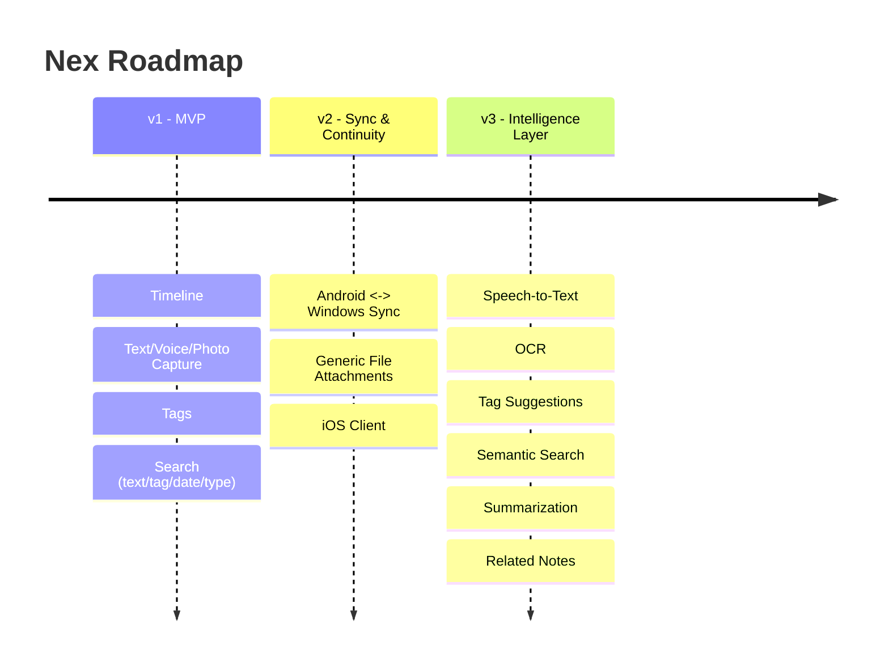

# Nex — Roadmap

> Sequencing detail for [`Nex Product Specification`](./02-nex-product-specification.md#roadmap). Every item below is checked against the [Non-Negotiable Principles](./01-nex-product-vision.md#non-negotiable-principles) before it ships.

---

## v1 — Fastest Capture Experience (MVP)

**Theme:** Prove the two core promises — capture in under 3 seconds, find in under 3 seconds — with the smallest possible feature set.

| Feature | Status | Notes |
|---|---|---|
| Timeline (reverse-chronological, no folders) | Planned | See [Spec §Timeline](./02-nex-product-specification.md#timeline) |
| Text capture | Planned | Zero-field entry, auto-save |
| Voice capture | Planned | Instant-start recording |
| Photo capture | Planned | Camera + gallery, two taps |
| Auto-save (no Save button) | Planned | Core non-negotiable principle |
| Tags (optional, freeform) | Planned | Only organizational primitive |
| Search — keyword (text notes) | Planned | |
| Search — tag filter | Planned | |
| Search — date filter | Planned | |
| Search — content-type filter | Planned | Layered onto tag/date search, not a separate mode |
| Local-first storage, sync-ready schema | Planned | UUIDs, timestamps, `device_id`, `sync_version`, soft delete — see [`ARCHITECTURE.md`](./04-architecture.md) |
| Minimal dormant backend | Planned | Proves the sync contract early without being load-bearing |

**Exit criteria:** Usability testing shows median capture time < 3s and median find time < 3s across all three content types; crash-free session rate > 99.9%.

---

## v1.x — Stability & Polish

**Theme:** Harden what v1 shipped before adding anything new.

- Performance tuning for large timelines (thousands of notes).
- WCAG 2.1 AA accessibility audit and fixes (see [`DESIGN.md`](./05-design.md#accessibility)).
- Expanded automated performance budget tests in CI (see [`DEVELOPMENT.md`](./06-development.md#testing-strategy)).
- Localization groundwork (externalized strings; Persian as the first additional language, reflecting the product's origin).

---

## v2 — Sync & Continuity

**Theme:** Solve the original motivating problem in full — a user's captures should never be stranded on a single device. Sync ships as the **first** item of v2, not the last, per the product's founding requirement.

| Feature | Notes |
|---|---|
| **Real Android ⇄ Windows sync** | First item shipped in v2. Last-writer-wins conflict resolution; see [`ARCHITECTURE.md`](./04-architecture.md#sync) |
| Generic file attachments (4th capture type) | Deferred from v1 specifically because of the UX decisions it requires (preview, size limits, file types) — now addressed deliberately rather than rushed into v1 |
| iOS client | Joins the same sync backend and shared Core/Data packages |
| Backend hardening | Multi-device conflict test suite, delta-sync efficiency, deletion propagation and tombstone garbage collection |

**Exit criteria:** A user can capture offline on Android, and see the same note (including edits and tag changes) on Windows within an acceptable sync window once both devices are online; deletion and conflict test suites pass.

---

## v3 — The Intelligence Layer

**Theme:** Make everything captured — regardless of original format — as findable as typed text, using AI that never interrupts capture. Full detail in [`AI.md`](./09-ai.md).

| Feature | Notes |
|---|---|
| **Speech-to-text transcription** | Resolves the [voice-search limitation](./02-nex-product-specification.md#speech-to-text-note) noted since v1; voice notes join full-text search |
| **OCR** | Photo notes become text-searchable (e.g., photographed whiteboards, receipts, documents) |
| **Tag suggestions** | AI proposes tags post-capture; always optional, always dismissible, never auto-applied silently |
| **Semantic search** | Search by meaning, not just keyword match |
| **Summarization** | On-demand summaries for long text notes or clusters of related notes |
| **Related notes** | Surfaces connections between notes without requiring the user to organize manually |

**Exit criteria:** Voice and photo notes are fully part of unified search without any regression to capture speed; every AI feature is independently toggleable off with zero loss of core (v1) functionality.

---

## Explicitly Deferred / Not Currently Planned

Tracked for future evaluation, intentionally excluded from the roadmap above to protect focus:

- **Export** — evaluated only after v3 stabilizes; must be designed so it doesn't imply Nex becomes a long-term storage/organization system.
- **Team/multi-user collaboration** — out of scope indefinitely; contradicts the single-player, personal-inbox identity (see [Product Boundaries](./01-nex-product-vision.md#product-boundaries)).
- **Complex organizational features** (nested tags, folders, databases) — would contradict "Organize Later" as a philosophy, not just a feature gap.

---

## Versioning Policy

- **Major versions (v1, v2, v3)** correspond to the thematic phases above and may include platform-level or architectural shifts (e.g., sync activation, AI layer activation).
- **Minor versions (v1.1, v2.1, ...)** ship incremental features within an already-active theme.
- **Patch versions** are reserved for fixes and do not introduce new user-facing behavior.

Any roadmap change (addition, removal, re-sequencing) must be recorded in [`DECISIONS.md`](./10-decisions.md) with rationale.
