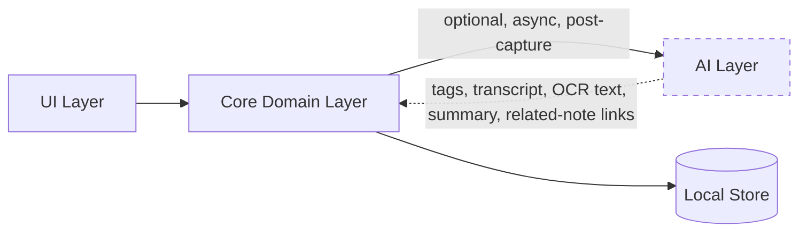

# Nex — AI Strategy

> Companion to [`Nex Product Vision`](./01-nex-product-vision.md#ai-philosophy) and [`ARCHITECTURE.md`](./04-architecture.md#modular-architecture). This document defines exactly where AI is allowed to participate in Nex, and where it is explicitly forbidden.

---

## Guiding Rule

> **AI is optional. AI never slows down capture.**

Every AI feature in Nex must satisfy both halves of this rule simultaneously. A feature that is optional but still delays capture (e.g., waiting for an AI tag suggestion before saving) is a violation. A feature that is fast but not optional (e.g., forced transcription with no way to disable it) is equally a violation.

---

## What AI Is Allowed to Do

AI exists to reduce friction **after** capture — helping the user find, understand, or connect what they've already saved. It is never a precondition for saving.

| Capability | Description | Target Version |
|---|---|---|
| **Tagging** | Suggests tags for a note after it's saved, based on its content | v3 |
| **Semantic search** | Finds notes by meaning/intent, not just literal keyword match | v3 |
| **Summarization** | Produces on-demand summaries of long notes or clusters of related notes | v3 |
| **Transcription (Speech-to-Text)** | Converts voice notes into searchable text, resolving the [v1 voice-search limitation](./02-nex-product-specification.md#speech-to-text-note) | v3 |
| **OCR** | Extracts text from photos so they become keyword-searchable | v3 |
| **Related notes** | Surfaces connections between notes without manual organization | v3 |

All six capabilities are:
- **Post-capture only** — they run after a note already exists and is safely persisted.
- **Asynchronous** — they never block the UI thread or the capture flow.
- **Dismissible** — any suggestion (a tag, a related note, a summary) can be ignored with no consequence.
- **Non-destructive** — AI never overwrites or deletes original user content; it only adds metadata (tags, transcript text, OCR text) alongside it.
- **Independently toggleable** — each capability can be turned off individually in settings, and the app must remain fully functional (per the v1 MVP feature set) with all of them off.

---

## What AI Is Never Allowed to Do

- **Block or delay capture.** No capture screen ever waits on an AI response before letting the user finish and return to the Timeline.
- **Require configuration before use.** AI features, when enabled, must work with sensible defaults — no prompt engineering or setup required of the user.
- **Silently modify original content.** Transcripts and OCR text are stored as derived, clearly-labeled data attached to the note — never merged into or replacing the user's original capture.
- **Make retrieval worse via false confidence.** Semantic search results must be clearly distinguishable from exact keyword matches so users can calibrate trust appropriately.
- **Transmit content without explicit opt-in.** Any AI feature that requires server-side processing (e.g., a cloud transcription model) must be opt-in and clearly disclosed; on-device processing is preferred wherever feasible.
- **Introduce a decision at capture time.** "Would you like AI to tag this?" is not an acceptable prompt during capture — that decision, if offered at all, belongs in settings, decided once, in advance.

---

## Architectural Boundary

AI lives in its own package (`packages/ai`, see [`DEVELOPMENT.md`](./06-development.md#folder-structure)) that the Core domain layer calls into through a well-defined, optional interface — never the reverse, and never from the UI directly.

The dashed boundary is intentional: **the AI layer can be deleted from a build entirely**, and Core, Data, and UI continue to compile and function, fully satisfying the v1 MVP. This is the architectural proof of "AI-optional," not just a policy statement.

---

## Data & Privacy Principles for AI

- **No note content is sent anywhere by default.** Any AI processing that requires leaving the device is explicitly opt-in per feature, not a blanket toggle.
- **On-device processing is preferred** for transcription and OCR where platform capability allows it, to keep private captures private.
- **AI-derived data is clearly labeled** in the data model (e.g., a transcript is stored as `transcript_text`, distinct from the original `content`/`media_url`), so the provenance of any searchable text is always inspectable and reversible.
- **No content is used to train models** without separate, explicit, revocable consent — never implied by simply enabling a feature.
- Logging rules from [`DEVELOPMENT.md`](./06-development.md#logging) apply equally to AI subsystems: no note content in logs, structured metadata only.

---

## Rollout Plan

AI capabilities are deliberately sequenced to v3, after both the capture experience (v1) and cross-device continuity (v2) are solid — because AI is the least essential ingredient to the product's founding promise and the most likely to introduce complexity if rushed.

1. **v1–v2:** No AI in the product. The Timeline, capture, tags, search, and sync must all prove their value on their own merits first.
2. **v3.0:** Transcription and OCR ship first, because they directly resolve a documented product gap (voice/photo notes not being keyword-searchable).
3. **v3.x:** Tag suggestions, semantic search, summarization, and related notes follow, each shipped independently and each independently toggleable.

See [`ROADMAP.md`](./08-roadmap.md#v3--the-intelligence-layer) for full sequencing.

---

## Success Criteria for AI Features

An AI feature is considered successful only if:

1. It measurably improves find-time or retrieval confidence (per the [Success Metrics](./01-nex-product-vision.md#success-metrics) in the Vision doc).
2. It introduces zero regression to capture-time performance, verified by the CI performance budget (see [`DEVELOPMENT.md`](./06-development.md#testing-strategy)).
3. Disabling it produces no error state or missing core functionality anywhere in the app.

If an AI feature cannot meet all three, it is not shipped, regardless of how technically impressive it is in isolation.
