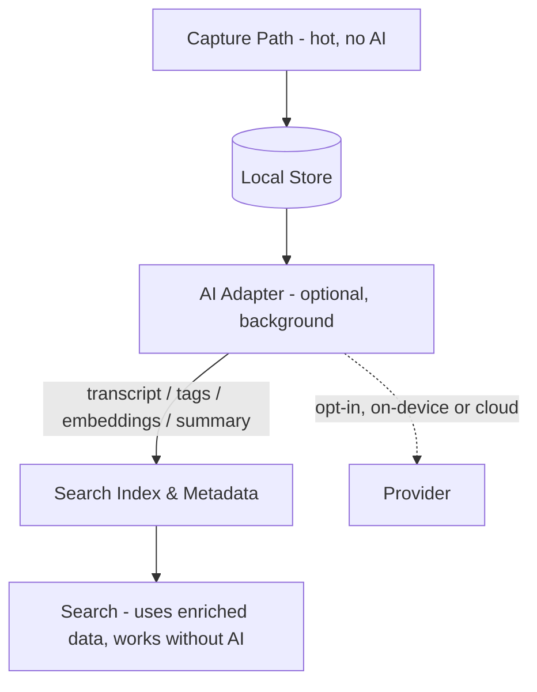

# Nex — AI Strategy

> **AI is optional. AI never slows down capture.**

**Status:** Authoritative · **Owner:** Product & Engineering · **Last updated:** 2026

Nex's relationship with AI is deliberately restrained. AI is a **layer above capture**, never a **gate in front of it**. Nothing about intelligence is allowed to compromise Nex's core promise: capture in under three seconds, find in under three seconds.

---

## AI Principles (Non-Negotiable)

1. **AI is optional.** Every AI feature can be disabled. The product is fully usable with zero AI.
2. **AI never interrupts capture.** No AI prompt, modal, suggestion, or processing may block or delay the moment of capture.
3. **AI assists after capture.** Intelligence runs in the background, on already-saved notes — tagging, search, summarization, transcription, OCR, related notes.
4. **Local-first still wins.** Where feasible, intelligence runs **on-device**. Any cloud intelligence is **opt-in** and privacy-respecting.
5. **No content exfiltration by default.** Note text and media are **not** sent to external services unless the user explicitly enables it.
6. **AI is swappable.** Intelligence is behind provider-agnostic adapters, so models can change without touching the product.
7. **Honesty.** AI-derived data (e.g., transcripts, suggested tags) is clearly labeled and editable, never silently authoritative.

> Rule of thumb: **if removing all AI changes the capture experience by zero milliseconds, the design is correct.**

---

## What AI May Do (Assist Only)

| Capability | Purpose | Version |
| --- | --- | --- |
| **Tagging** | Suggest optional tags for a note | v3 |
| **Semantic search** | Rank results by meaning, complementing keyword search | v3 |
| **Summarization** | Optional summaries of longer notes | v3+ |
| **Transcription** | Convert audio to text → audio becomes searchable | v3 |
| **OCR** | Extract text from photos → image text becomes searchable | v3+ |
| **Related Notes** | Surface related captures | v3+ |

## What AI Must Never Do

- ❌ Block, delay, or gate capture.
- ❌ Require a decision (title, folder, format, confirmation) at capture time.
- ❌ Send user content off-device by default.
- ❌ Become a dependency — the app must work fully with AI disabled or unavailable.
- ❌ Silently rewrite or delete user content.
- ❌ Introduce UI complexity that slows finding.

---

## Integration Model

AI lives in a **dedicated, optional layer** with strict boundaries. The capture and search hot paths **never import it directly**.



Key properties:

- **Capture writes first**, always. AI consumes notes **after** they are durably stored.
- **AI enriches metadata/indexes** (transcripts, tags, embeddings) that search *may* use but does *not require*.
- **Search degrades gracefully:** if AI is off or a transcript is missing, search falls back to keyword/tag/date. Audio without a transcript simply isn't text-searchable — and the UI says so (the v1 limitation, now resolvable in v3).

---

## Provider Strategy

- **Provider-agnostic adapters.** A common interface (`Transcribe`, `Embed`, `SuggestTags`, `Summarize`, `OCR`) hides the model behind it.
- **Pluggable backends:** on-device models, a self-hosted service, or a cloud provider — chosen by the user, all behind the same interface.
- **No vendor lock-in.** Swapping a model must not touch domain, storage, or UI code.
- **Default to local.** The out-of-the-box experience prefers on-device intelligence; cloud is an explicit opt-in.

```
interface AIAdapter {
  transcribe?(audio): Promise<Transcript>
  embed?(text): Promise<Vector>
  suggestTags?(note): Promise<Tag[]>
  summarize?(note): Promise<Summary>
  ocr?(image): Promise<OCRText>
}
```

Each method is **optional** (`?`): an adapter may implement any subset. Missing capabilities are simply unavailable, not errors.

---

## Privacy & Trust

- **Opt-in cloud.** Any intelligence that contacts an external service requires explicit, informed consent.
- **No silent uploads.** The user knows what leaves the device and can revoke it.
- **Editable AI output.** Transcripts, tags, and summaries are suggestions/users can correct; they're clearly marked as AI-generated.
- **Transparent limits.** If AI is unavailable or disabled, the product states plainly what is and isn't searchable (e.g., "audio searchable by tag/date only").

---

## Version Mapping

| Version | AI present? | Notes |
| --- | --- | --- |
| **v1** | None | Capture is never touched; deliberately AI-free |
| **v2** | None (focus: sync) | Intelligence deferred; sync is the priority |
| **v3** | Opt-in assist | Transcription, semantic search, tag suggestions, OCR, summarization, related notes |

---

## Failure Modes

| Scenario | Behavior |
| --- | --- |
| AI disabled by user | Everything works exactly like AI-free Nex |
| AI provider unavailable/errored | Capture/search unaffected; enrichment silently skipped/retried |
| Transcription fails for an audio note | Note remains tag/date-searchable; UI keeps the honest label |
| Cloud opt-in revoked | On-device features continue; cloud features stop; no data loss |

---

> In Nex, AI is a quiet assistant that tidies up **after** the idea is safely captured — never a bouncer at the door.
