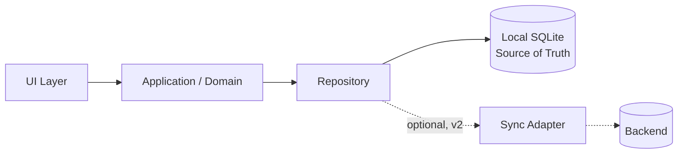
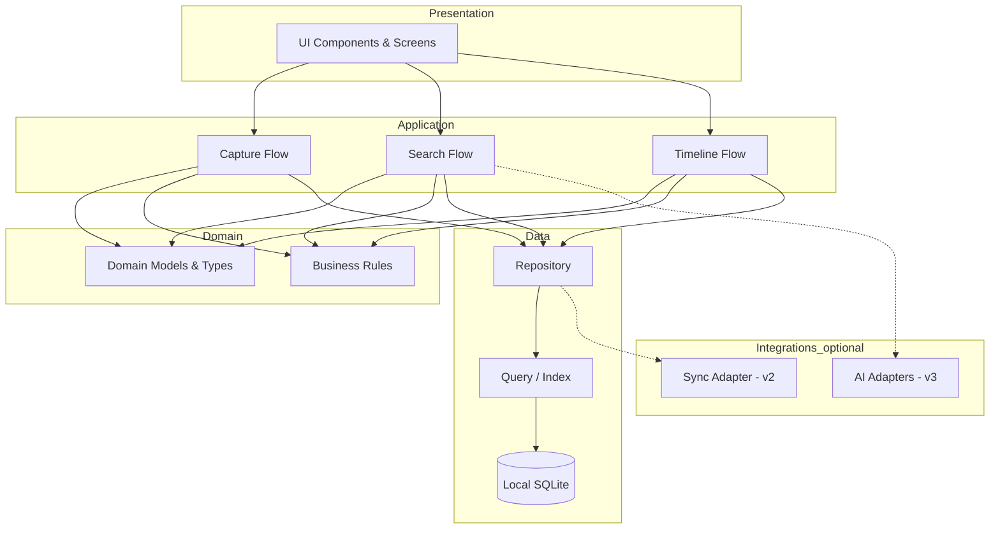
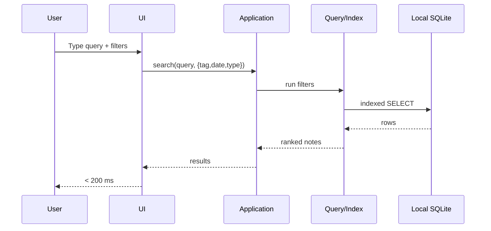

# Nex — Architecture

> Local-first. Offline-first. Modular. Built so that sync can arrive in v2 with **no rewrite**.

**Status:** Authoritative · **Owner:** Engineering · **Last updated:** 2026

---

## Local-First Architecture

Nex treats the **device's local store as the single source of truth**.

- Every read and write goes to the **local database** first.
- The app is **fully functional offline**. A network connection is never required to capture or find a note.
- Any cloud backend is a **sync layer**, not a dependency. If the backend disappears, Nex still works.
- Each record carries everything sync needs from day one: a stable client-generated `id`, `created_at`, `updated_at`, `rev`, and a soft-delete `deleted_at`.

This choice is deliberate: the product's core problem is **lost and scattered ideas**. A purely cloud-dependent app fails the moment connectivity drops; a local-first app never fails to capture.



---

## Modular Architecture

Nex is layered. Each layer has one responsibility and depends only on the layer beneath it. This keeps the capture path fast, the code testable, and future features (sync, AI) isolated.



---

## Layers

| Layer | Responsibility | Depends on |
| --- | --- | --- |
| **Presentation (UI)** | Renders timeline, capture, search, note detail. Pure and reactive. | Application |
| **Application** | Orchestrates user flows (capture, search, browse). No storage details. | Domain, Data |
| **Domain** | Core models (`Note`), invariants, and business rules. Framework-free. | — |
| **Data** | Repository pattern over SQLite. The source of truth. Indexes for search. | Local DB |
| **Integrations (optional)** | Sync adapter (v2) and AI adapters (v3). Never on the capture path. | Data / external |

### Why these boundaries?

- **Domain has no dependencies**, so it is trivially unit-testable and portable across platforms.
- **The repository is the only thing that touches storage**, so swapping or adding a sync backend changes nothing in the UI.
- **Integrations are optional and off the hot path**, so AI and sync can never degrade capture performance.

---

## Data Flow

### Capture (the critical path)

The capture path is optimized for **durability and speed**. A note is reported as "saved" only after it is durably written locally.

```mermaid
sequenceDiagram
    participant U as User
    participant UI
    participant APP as Application
    participant REPO as Repository
    participant DB as Local SQLite
    U->>UI: Tap +, provide content
    UI->>APP: createNote({type, content})
    APP->>APP: Build Note (id, timestamps, rev=1)
    APP->>REPO: insert(note)
    REPO->>DB: BEGIN; INSERT; COMMIT
    DB-->>REPO: ok
    REPO-->>APP: persisted
    APP-->>UI: return to timeline
    UI-->>U: Newest note on top
```

There is **no network call** on this path in v1, and none that blocks capture in any version.

### Search



Search runs entirely against the **local index**, so it is fast and works offline.

---

## Storage

- **Engine:** embedded SQLite — fast, reliable, transactional, available on every target platform.
- **Source of truth:** the local SQLite database. There is no higher authority.
- **Media:** audio and photo binaries are stored as **files** on disk; the DB stores a reference (`media_uri`) and a content **hash** (`media_hash`) for dedupe and sync.
- **Indexes:** maintained on `created_at` (timeline), `tags` (tag filter), and text content (full-text search). For text search, SQLite **FTS5** is recommended.
- **Transactions:** every write is wrapped in a transaction so a capture is **atomic** — either fully saved or not at all.
- **Migrations:** schema changes are versioned and forward-only; the sync contract fields (`id`, `rev`, timestamps, `deleted_at`) are stable from v1.

### Text search detail

- Text notes: matched via FTS5, case-insensitive, ranked by relevance.
- Audio notes (v1): **no text index** — intentionally. They are filtered by tag/date only, and the UI says so.
- Photos (v1): matched by tag/date; OCR text indexing arrives in v3.

---

## Sync

Sync is **inactive in v1** but **architecturally complete**: the data model already contains the full sync contract, so v2 needs no migration or rewrite.

### Principles

- **Local-first:** writes always hit the local store; sync is eventual and additive.
- **Last-write-wins** by `updated_at`, with `rev` to detect concurrent edits. Tag edits **merge by union** to avoid losing tags.
- **Tombstones:** deletions are soft (`deleted_at`) so they propagate to other devices instead of resurrecting.
- **Content-addressed media:** media uploads are keyed by `media_hash`, deduplicating identical files across devices.

### Sync data flow (v2)

```mermaid
sequenceDiagram
    participant D1 as Device A
    participant API as Sync Backend
    participant D2 as Device B
    D1->>API: PUSH pending changes (notes + tombstones + revs)
    API->>API: Apply LWW by updated_at; merge tags
    API-->>D1: 200 + server revs
    D2->>API: PULL since last_sync
    API-->>D2: changed notes + tombstones
    D2->>D2: Apply locally; update sync_state=synced
    Note over D1,API: Media: upload by content hash (dedup)
```

### Conflict resolution

| Conflict | Rule |
| --- | --- |
| Same note edited on two devices | Highest `updated_at` wins; `rev` flags the conflict for optional review |
| Tags added/removed concurrently | **Union merge** — keep all tags, never silently drop one |
| Deleted on one, edited on another | Deletion wins (tombstone), with the edit recoverable from history |
| Media differences | Reconciled by content hash; identical content is deduplicated |

The backend is intentionally **dumb**: it stores and forwards records and resolves conflicts by deterministic rules. No business logic lives only in the cloud.

---

## Scalability

Nex is personal and local, so "scale" means something specific here:

- **Local scale:** tens of thousands of notes must remain instant. Achieved via indexes (timeline by `created_at`, FTS5 for text, index on tags) and lazy rendering of the timeline (virtualized lists).
- **Media scale:** binaries stored as files and deduplicated by hash; the DB stays small and fast.
- **Sync scale (v2):** the backend is stateless per request and uses `last_sync` cursors, so pull/push are incremental and cheap regardless of total history.
- **Team scale:** not a goal. Nex is single-user by design; we do not optimize for shared/enterprise workloads.

---

## Performance Principles

1. **Capture is the hot path.** Nothing asynchronous or network-bound may block it. Persist locally, then return.
2. **Report success only after durability.** Never tell the user "saved" before the write is committed.
3. **Index for the two jobs.** Optimize indexes for *timeline ordering* and *search* — the two things users do constantly.
4. **Keep the binary small.** Minimal dependencies, small bundle, fast cold start — lightness is a feature.
5. **Offline is the default.** Every primary action works with no network.
6. **Measure the 3-second budget.** Capture < 3 s and search < 200 ms are continuously benchmarked.

---

> The architecture's job is simple: **never let infrastructure get between a user and their next capture.**
