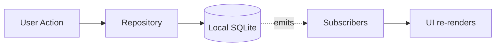

# Nex — Development Guide

> Write code like the product feels: **simple, fast, reliable, and free of unnecessary ceremony.**

**Status:** Authoritative · **Owner:** Engineering · **Last updated:** 2026

This guide is the contract for how Nex is built. It exists so that any contributor can produce code that fits the codebase and the product's philosophy without guessing.

---

## Coding Principles

1. **Capture is sacred.** Never add blocking work, network calls, or prompts to the capture path.
2. **Local-first, always.** The local store is the source of truth. Anything else (sync, AI) is optional and off the hot path.
3. **Simplicity over cleverness.** Prefer boring, readable code. Optimize only with evidence.
4. **Small, layered modules.** Each module has one job and depends only on the layer beneath it (see [04-architecture.md](./04-architecture.md)).
5. **Types are the contract.** The domain layer is fully typed and framework-free.
6. **Fail safe.** A failure must never lose a capture. Prefer durable local writes and graceful degradation.
7. **No feature without a principle.** If it slows capture or adds UI decisions at capture time, it doesn't ship.

---

## Folder Structure

The structure mirrors the architecture layers so that dependencies always point downward.

```
src/
├── app/                # Screens & routes (Presentation): timeline, capture, search, detail
├── capture/            # Quick-capture flows (text, audio, photo)
├── search/             # Search + filters (Presentation/Application)
├── store/              # Local-first data layer (Repository + SQLite + indexes)
│   ├── repository.ts   # The only module that touches storage
│   ├── schema.ts       # Versioned schema + migrations
│   └── fts.ts          # Full-text search index
├── sync/               # Sync adapter (INACTIVE in v1; ACTIVE in v2)
├── ai/                 # Optional AI adapters (v3) — never imported by capture
├── ui/                 # Reusable components & design system
├── shared/
│   ├── domain/         # Framework-free models, types, invariants
│   ├── utils/          # Pure helpers (ids, dates, hashing)
│   └── constants.ts    # Tagline, defaults, limits
└── ...
```

**Dependency rule:** `app → capture/search → shared/domain → store`. `sync` and `ai` are optional leaves — nothing in the capture path may import them.

---

## Naming Conventions

| Element | Convention | Example |
| --- | --- | --- |
| Files (components) | `PascalCase.tsx` | `NoteCard.tsx` |
| Files (logic/modules) | `kebab-case.ts` or `camelCase.ts` | `note-repository.ts` |
| Types & interfaces | `PascalCase` | `Note`, `SearchFilters` |
| Functions & variables | `camelCase` | `createNote`, `createdAt` |
| Constants | `UPPER_SNAKE` | `MAX_CAPTURE_MS` |
| Enums/unions | `PascalCase`, members `kebab`/`snake` as fits | `type NoteType = 'text' \| 'audio' \| 'photo'` |
| Database columns | `snake_case` | `created_at`, `media_uri` |
| CSS/Tokens | `kebab-case` | `--color-ink`, `text-caption` |

Be **consistent within a file** and **descriptive over abbreviated**: `createdAt` beats `ca`.

---

## State Management Recommendation

Nex's state is simple — keep it that way.

- **Server/source of truth = the local store.** UI state is derived from it.
- **Repository + reactive subscriptions.** Components subscribe to the repository; the local DB pushes updates (e.g., a new capture appears in the timeline instantly).
- **UI-only state** (open/closed sheets, active filters, search query) lives in lightweight local component/state hooks. No global store is needed for v1.
- **Avoid premature abstraction.** Do not introduce a heavy state library until the simple model proves insufficient.



---

## Error Handling

- **Never lose a capture.** If a write fails, retry locally and surface a clear, non-blocking error — but keep the content in memory until it is safely stored.
- **Fail closed on ambiguity for writes; fail open for reads.** A failed search returns an empty result with a message, not a crash.
- **Boundary errors:** each layer translates errors into typed domain errors it understands. The UI never sees raw DB/network exceptions.
- **Typed errors:** define a small set of domain error types (`CaptureFailed`, `SearchUnavailable`, `SyncConflict`) instead of throwing strings.
- **Graceful degradation:** sync/AI failures must never break capture or search. They log and retry silently.

---

## Logging

- **Levels:** `error` > `warn` > `info` > `debug`. Default to `warn` in production.
- **Structured and local.** Logs are machine-readable and stay on-device in v1 (privacy). No telemetry that exfiltrates content.
- **Never log sensitive content** by default. Log IDs, types, durations, and error codes — not note text or media.
- **Capture path logging is minimal** and never blocking (async, sampled).
- **A debug toggle** enables verbose local logs for troubleshooting, off by default.

---

## Testing Strategy

Tests protect the two promises: **nothing is ever lost**, and **finding is instant**.

| Layer | Strategy | Priority |
| --- | --- | --- |
| **Domain** | Pure unit tests for models, invariants, conflict rules | High |
| **Store / Repository** | Integration tests against a real (temporary) SQLite DB — especially the capture write path and search index | **Critical** |
| **Capture flow** | E2E/integration: open → capture → persisted → on timeline, under 3 s budget | **Critical** |
| **Search** | Tests for text, tag, date, and type filters + ranking | High |
| **Sync (v2)** | Conflict-resolution tests (LWW, tag union merge, tombstones) | High (v2) |
| **UI** | Component tests for accessibility, keyboard, and reduced-motion | Medium |
| **Performance** | Benchmarks: capture < 3 s, search < 200 ms | Continuous |

**Principles:**

- Prefer **testing behavior over implementation.**
- The repository is tested against a **real database**, not mocks, so persistence bugs surface.
- Performance budgets are enforced in CI as guardrails, not aspirational docs.

---

## Git Workflow

- **Branch from `main`.** Name branches by intent: `feat/audio-capture`, `fix/search-ranking`, `docs/architecture`.
- **Small, focused PRs.** One concern per PR. Easier review, safer merges.
- **Conventional commits** for clarity:
  - `feat:` new feature
  - `fix:` bug fix
  - `perf:` performance improvement
  - `refactor:` no behavior change
  - `test:` tests only
  - `docs:` documentation
  - `chore:` tooling/build
- **PR checklist (enforced):**
  - [ ] Does not add friction to the capture path.
  - [ ] Local-first: no new hard dependency on the network.
  - [ ] Tests added/updated for behavior.
  - [ ] Performance budgets still met.
  - [ ] Accessibility maintained (keyboard, contrast, reduced-motion).
- **Rebase, don't merge-bomb.** Keep history readable.
- **Semantic versioning:** `MAJOR.MINOR.PATCH`; sync contract changes are `MAJOR`.

See [07-contributing.md](./07-contributing.md) for the contributor workflow.

---

> Code quality, for Nex, has one ultimate test: **does this change keep capture effortless and find instant?**
> 
