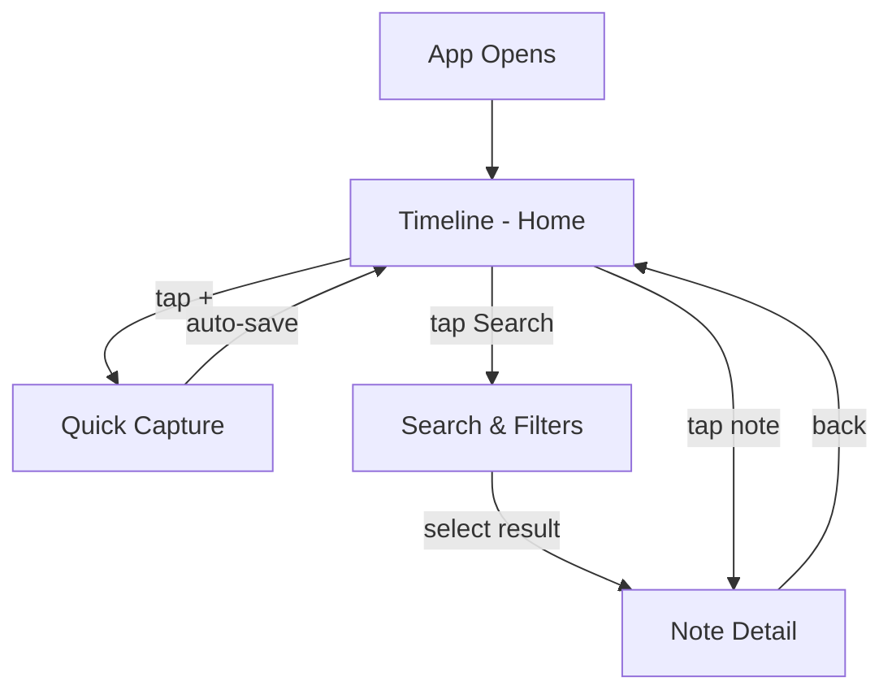
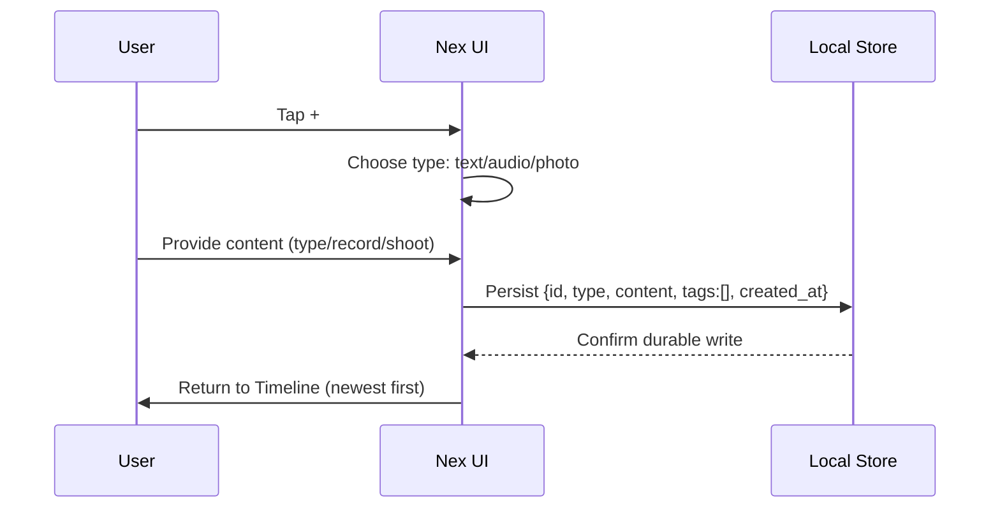
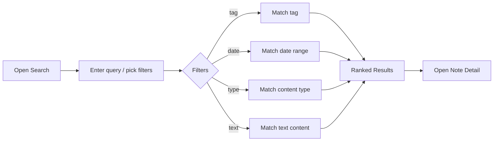
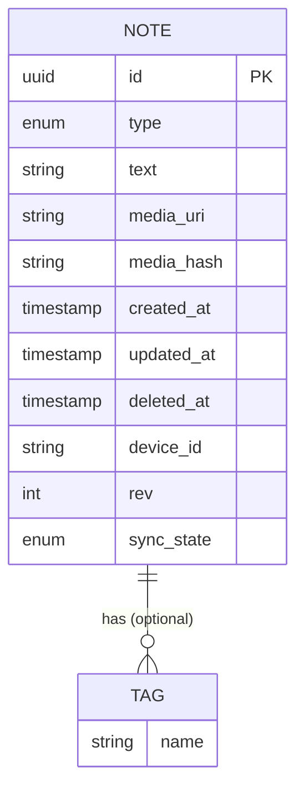

# Nex — Product Specification

> The single source of truth for what Nex does, how it behaves, and what is explicitly out of scope.

**Status:** Authoritative · **Owner:** Product · **Last updated:** 2026

---

## Product Overview

Nex is a **personal capture tool** — the inbox for the human mind. It does exactly two things exceptionally well:

1. **Capture** anything in under three seconds.
2. **Find** anything in under three seconds.

Everything else — organization, intelligence, sync — is layered on top without ever getting in the way of capture. Nex is local-first, offline-first, minimal, and fast.

---

## Goals

- Make capturing a thought faster than thinking about it.
- Make finding a previously captured thought nearly instant.
- Provide one unified timeline as the default home — no folders, no friction.
- Ship a sync-ready data architecture from day one (active sync arrives in v2).
- Keep the surface area small enough that every feature is learnable in under 30 seconds.

## Non-Goals

- We are **not** building a knowledge management system.
- We are **not** building project management, tasks, or to-dos.
- We are **not** building a second-brain platform.
- We are **not** replacing Notion, Obsidian, or Evernote.
- We are **not** optimizing for time-in-app; Nex is meant to be opened and closed quickly.

---

## MVP Scope

v1 includes only what directly serves the two product goals: **fast capture** and **fast find**.

### Timeline (Home)

- Time-ordered timeline, newest notes first.
- Simple, minimal cards.
- No default folders.

### Quick Capture

- A large **`+`** button starts capture.
- Three capture types only (see *Feature Specifications*):
  - **Text**
  - **Audio** (start instantly)
  - **Photo** (camera or gallery)
- A fourth type — **Generic File** — is deferred to **v2** because it introduces UX decisions (preview, size, type) that conflict with "no decisions at capture time."
- **Auto-save**, no Save button.
- Return directly to the timeline.

### Search

Search is the second most important capability after capture. v1 supports:

- Full-text search within **text** notes.
- Search/filter by **tag**.
- Search/filter by **date**.
- A **content-type filter** (text / audio / photo), applied as a simple filter on top of the same search — **not** a separate search mode — to keep the v1 UI simple.

### Tags

The **only** organization tool in the MVP. Adding a tag is **entirely optional**. Examples: `idea`, `work`, `shopping`, `learning`, `inspiration`.

---

## User Stories

### Capture

- **US-01:** As a user, I can tap `+` and immediately type a text note so that it is saved with no extra steps.
- **US-02:** As a user, I can start recording audio with a single tap so that I capture a spoken idea instantly.
- **US-03:** As a user, I can snap a photo or pick one from my gallery so that I capture a visual idea instantly.
- **US-04:** As a user, my note is saved automatically with no Save button.
- **US-05:** As a user, after capturing I return straight to the timeline.

### Browse

- **US-06:** As a user, I see my notes in a single timeline, newest first.
- **US-07:** As a user, I can tap a note to open and read or play it.

### Organize

- **US-08:** As a user, I can optionally add one or more tags to a note.
- **US-09:** As a user, tags are never required.

### Find

- **US-10:** As a user, I can search the text of my text notes.
- **US-11:** As a user, I can filter notes by tag.
- **US-12:** As a user, I can filter notes by date.
- **US-13:** As a user, I can filter notes by content type (text / audio / photo).
- **US-14:** As a user, I see a clear label on audio notes that they are searchable only by tag or date, so I have the right expectations.

---

## Functional Requirements

| ID | Requirement |
| --- | --- |
| FR-01 | The app opens directly to the timeline. |
| FR-02 | A persistent `+` button initiates Quick Capture. |
| FR-03 | Capture supports text, audio, and photo. |
| FR-04 | Captures are auto-saved with a client-generated unique ID and timestamps. |
| FR-05 | No Save button exists in the capture flow. |
| FR-06 | After capture, the user returns to the timeline. |
| FR-07 | The timeline lists notes newest-first. |
| FR-08 | Notes can carry zero or more optional tags. |
| FR-09 | Text search matches text-note content. |
| FR-10 | Notes can be filtered by tag. |
| FR-11 | Notes can be filtered by date. |
| FR-12 | Notes can be filtered by content type. |
| FR-13 | Audio notes show a "searchable by tag/date only" affordance. |
| FR-14 | The data model is local-first and sync-ready (stable ID, timestamps, revision). |
| FR-15 | Notes support soft delete (recoverable / sync-safe). |

## Non-Functional Requirements

| Category | Requirement |
| --- | --- |
| **Performance** | Capture persisted in < 3 s; local search < 200 ms. |
| **Reliability** | A capture is reported as saved only after it is durably written locally. |
| **Offline** | Fully functional offline; sync is additive. |
| **Privacy** | Local-first; user data is not sent to any server in v1. |
| **Portability** | Architecture must support Android, Windows, and iOS from the start. |
| **Accessibility** | Reachable, high-contrast, keyboard- and screen-reader-friendly. |
| **Maintainability** | Modular layers; storage, UI, and (future) sync are isolated. |
| **Footprint** | Small app size; minimal dependencies. |

---

## Feature Specifications

### Navigation

The app has **one primary surface**: the Timeline. From it, two actions are reachable in a single tap: **Capture** (`+`) and **Search**.

There is no nested folder hierarchy, no settings maze, and no onboarding wizard blocking the first capture.

### User Flows

#### Capture flow

Note the absence of a title prompt, a folder picker, or a Save action.

#### Search flow

---

## Search

Search is the **second pillar** of Nex — if something cannot be found, capturing it was worthless.

**v1 capabilities:**

| Mode | Scope | Notes |
| --- | --- | --- |
| **Text** | Text-note content | Keyword/substring match, case-insensitive |
| **Tag** | Any note's tags | Multi-select AND/OR (simple) |
| **Date** | `created_at` | Day / range presets |
| **Content type** | Filter: text / audio / photo | Applied on top of the active search, not a separate mode |

**Honest limitation (audio):** Audio notes have no transcript in v1, so they carry no searchable text. They are found **only by tag or date**. The UI states this plainly next to each audio note (e.g., *"Searchable by tag/date only"*) so users form correct expectations. Transcription in v3 makes audio text-searchable.

**Future:** Semantic search (v3) ranks results by meaning in addition to keywords.

---

## Tags

- Tags are the **only** organization tool in v1.
- Tags are **always optional** — a note with no tag is perfectly valid.
- Tags are free-form but reused tags are suggested from history.
- Common examples: `idea`, `work`, `shopping`, `learning`, `inspiration`.
- Storage: stored inline on the note (simplest); a tag index can be derived for fast filtering.

---

## Timeline

- A single, chronological list of all notes, **newest first**.
- Each note renders as a **simple, minimal card**: a content preview, type icon, relative timestamp, and optional tags.
- No folders, no grouping by default — one stream.
- The timeline is the **home** and the default landing surface.

---

## Quick Capture

The defining feature. Design constraints:

- One tap from home to start (`+`).
- **Three types only** in v1: text, audio, photo.
- **No decisions at capture time**: no title, no folder, no format, no Save.
- **Auto-save**: the note is durably written the moment content exists.
- **Direct return** to the timeline after capture.

| Type | Input | Storage |
| --- | --- | --- |
| **Text** | Keyboard input | `text` field |
| **Audio** | Instant record / stop | Local media file + metadata |
| **Photo** | Camera or gallery | Local media file + metadata |
| ~~Generic file~~ | _Deferred to v2_ | _Pending UX decisions_ |

---

## Data Model

The model is **local-first and sync-ready** from v1: every record carries a stable, client-generated unique ID and timestamps, and supports soft delete and revision tracking.

### `note`

| Field | Type | Description |
| --- | --- | --- |
| `id` | UUID (v7) | Globally unique, generated on client. Never changes. |
| `type` | enum | `text` \| `audio` \| `photo` |
| `text` | string (nullable) | Text content (text notes; transcript when available in v3) |
| `media_uri` | string (nullable) | Local reference to the audio/photo blob |
| `media_hash` | string (nullable) | Content hash for dedupe/sync (v2) |
| `tags` | string[] | Optional, zero or more |
| `created_at` | ISO-8601 | Client clock at creation |
| `updated_at` | ISO-8601 | Last modification time |
| `deleted_at` | ISO-8601 (nullable) | Soft-delete tombstone (sync-safe) |
| `device_id` | string | Originating device |
| `rev` | integer | Monotonic revision counter for conflict resolution |
| `sync_state` | enum | `pending` \| `synced` \| `conflict` (v2) |

### Design notes

- **No folders, no notebooks.** Tags are the only grouping primitive.
- **Soft delete** ensures deletions propagate correctly during sync.
- **`id` + `rev` + `updated_at`** are the sync contract; they exist from v1 even while sync is inactive, so v2 needs no data migration.
- **Media** is stored locally as files; the DB stores a reference and a hash. Sync uploads media by content hash (deduplicated).

### Entity overview

---

## Sync Strategy

**v1:** Local-first only. The architecture is **sync-ready** but no cross-device sync is active. This is deliberate: the data model already includes everything sync needs, so v2 requires **no rewrite**.

**v2:** Real cross-device sync (Android ↔ Windows ↔ iOS) is the **headline** feature and the first item of v2, not the last.

**Principles:**

- Reads and writes always go to the **local store**; the app is fully usable offline.
- Each note has a stable `id`, `rev`, and timestamps — the minimal sync contract.
- A minimal backend exists conceptually from v1 (an identity for every record), even if inactive.
- Conflict resolution: **last-write-wins** by `updated_at`, with `rev` to detect concurrent edits; tags merge by union.
- Media sync uses content-addressed storage keyed by `media_hash`.

See [ARCHITECTURE.md](./04-architecture.md) for the full sync data flow.

---

## AI Roadmap

AI is **optional** and **never blocks capture**. Nothing in v1 uses AI.

| Version | AI capability | Effect |
| --- | --- | --- |
| v1 | — | No AI; capture is never interrupted |
| v3 | Transcription (speech-to-text) | Audio notes become text-searchable |
| v3 | Semantic search | Rank results by meaning |
| v3 | Tag suggestions | Optional, opt-in auto-tagging |
| v3+ | Summarization | Optional summaries of notes |
| v3+ | OCR (photos) | Text in photos becomes searchable |
| Future | Related Notes | Surface related captures |

See [AI.md](./09-ai.md) for the full strategy.

---

## Roadmap (Summary)

- **v1 — Fastest capture experience:** Timeline, text/audio/photo capture, tags, instant local search, sync-ready local-first architecture.
- **v2 — Everywhere:** Cross-device sync (Android, Windows, iOS) as the headline; generic file capture.
- **v3 — Intelligence:** Transcription, semantic search, OCR, tag suggestions, summarization, related notes.

See [ROADMAP.md](./08-roadmap.md) for the detailed version plan.

---

## Future Features

Explicitly **deferred** — they must never change Nex's core identity:

- Speech-to-text / transcription (v3)
- Related Notes (v3+)
- Export (future)
- Generic file capture (v2)
- Complex organization — notebooks, hierarchies, links (future, optional)

---

## Release Plan

| Version | Theme | Headline deliverables | Exit criteria |
| --- | --- | --- | --- |
| **v1.0 (MVP)** | Fastest capture | Timeline, text/audio/photo capture, tags, text/tag/date/type search, local-first storage | Capture < 3 s; search < 200 ms; all FR-01..15 met |
| **v1.x** | Polish & reliability | Performance, accessibility, offline edge cases | Reliability ≥ 99.99% local persistence |
| **v2.0** | Everywhere | Cross-device sync; generic file capture | Sync convergence ≥ 99.9% across devices |
| **v3.0** | Intelligence | Transcription, semantic search, OCR, tag suggestions, summarization | Audio searchable by text; AI never blocks capture |

---

> *Capture First. Organize Later. Find Instantly.*
