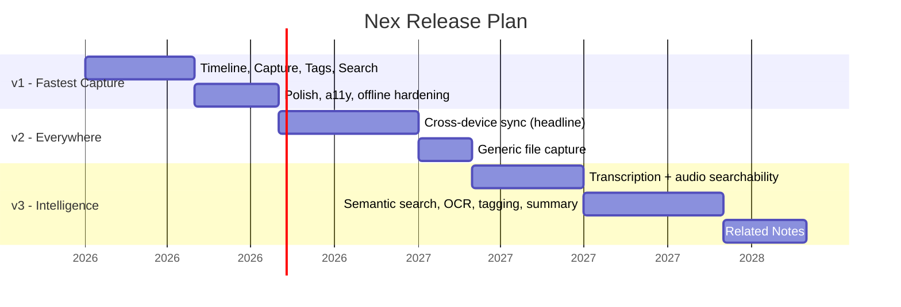

# Nex — Roadmap

> From the fastest capture experience to an intelligent, everywhere-available inbox — without ever compromising capture.

**Status:** Living document · **Owner:** Product & Engineering · **Last updated:** 2026

This roadmap protects one thing above all: **the moment of capture.** Every version adds capability *around* capture; none adds friction *to* it.

---

## Guiding Rules

1. **Capture budget is fixed.** Every version must keep capture under 3 seconds and offline.
2. **Organize later, always.** New organization never moves into the capture flow.
3. **AI is additive.** Intelligence assists after capture; it never gates or interrupts it.
4. **Sync is the v2 headline.** Cross-device sync is the first item of v2, not the last — because scattered ideas are the core problem.
5. **Scope is defended.** Features are version-gated to keep v1 light.

> Note on scope: the original product notes listed several intelligent features under an ambiguous "v1" heading. The roadmap below resolves that ambiguity by aligning with the rest of the spec — transcription is **v3**, sync is **v2**, generic file capture is **v2**. See [ADR-0003](./10-decisions.md).

---

## Roadmap Overview

*(Dates are illustrative sequencing, not commitments.)*

---

## v1 — Fastest Capture Experience

**Theme:** The fastest, lightest way to capture and find anything.

| Area | Deliverable |
| --- | --- |
| **Timeline** | Single, newest-first stream; minimal cards; no folders |
| **Quick Capture** | Text, audio, photo; auto-save; no Save button; return to timeline |
| **Tags** | Optional tagging — the only organization tool |
| **Search** | Text + tag + date + content-type filter |
| **Honest audio UX** | Audio labeled "searchable by tag/date only" |
| **Architecture** | Local-first store, **sync-ready** from day one (stable id, rev, timestamps, tombstones) |

**Exit criteria**

- Capture < 3 s; search < 200 ms.
- 99.99% of captures durably persisted before UI confirmation.
- Every FR-01…15 met; learnable in < 30 s.

### v1.x — Polish & Reliability

- Performance and cold-start improvements.
- Accessibility hardening (keyboard, contrast, reduced-motion).
- Offline edge cases and data-integrity safeguards.
- Timeline virtualization for very large histories.

---

## v2 — Everywhere

**Theme:** Your inbox, on every device — seamlessly.

> Cross-device sync is the **headline** of v2 and its **first** deliverable. The core problem (scattered, lost ideas) isn't truly solved until notes are coherent across Android, Windows, and iOS.

| Area | Deliverable |
| --- | --- |
| **Cross-device sync** (headline, first) | Android ↔ Windows ↔ iOS convergence using the v1 sync contract |
| **Conflict resolution** | Last-write-wins by `updated_at`; tag union-merge; tombstones |
| **Media sync** | Content-addressed uploads by hash (deduplicated) |
| **Generic file capture** | Fourth capture type (with preview/size/type handling) |
| **Sync UX** | Optional, non-intrusive; never blocks capture |

**Exit criteria**

- ≥ 99.9% of changes converge across devices.
- Capture remains < 3 s and fully offline-capable.
- No data migration required from v1 (contract was already in place).

---

## v3 — Intelligence

**Theme:** Optional intelligence that makes the inbox smarter — after capture.

> Intelligence is **opt-in** and **never on the capture path.** Transcription is the keystone: it finally makes audio notes **text-searchable**, resolving the v1 limitation.

| Area | Deliverable | Effect |
| --- | --- | --- |
| **Transcription** (speech-to-text) | Audio → text | Audio becomes searchable by content |
| **Semantic search** | Meaning-based ranking | Find by intent, not just keywords |
| **OCR** (photos) | Extract text from images | Text in photos becomes searchable |
| **Tag suggestions** | Optional auto-tagging | Faster, optional organization |
| **Summarization** | Optional note summaries | Triage long captures |
| **Related Notes** | Surface related items | Light discovery (no heavy graph) |

**Exit criteria**

- Audio notes searchable by text (transcription available).
- AI features are **toggleable** and never delay capture or search below budgets.

---

## v3.x and Beyond

Continued refinement, always subordinate to capture:

- Smarter, faster local search.
- Broader platform support and packaging.
- Optional, privacy-respecting cloud intelligence (opt-in only).
- Performance hardening at large local scale.

---

## What Stays Out (Unless It Reinforces Capture)

- Becoming a knowledge-management or second-brain platform.
- Notebooks, hierarchies, backlinks, and complex organization as **core** features.
- Collaboration, sharing, and multi-user (Nex is personal).
- Monetization-driven engagement features (Nex is not optimized for time-in-app).

These may exist as **optional, non-intrusive** layers in the far future, but they must **never** change Nex's identity.

---

## How to Read This Roadmap

- **Versions are themes, not dates.** We ship when the exit criteria are met.
- **Capture is the constant.** If a future feature conflicts with the 3-second capture budget, it is reworked or cut.
- **Feedback shapes sequencing.** User demand may reorder within a version's theme, but never at capture's expense.

---

> Each version answers one question better: *how fast can you capture, and how fast can you find it?*
